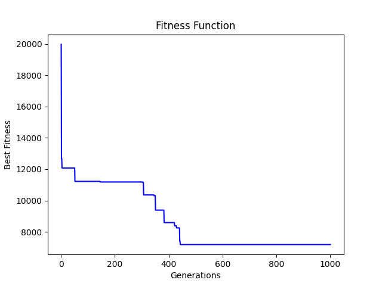
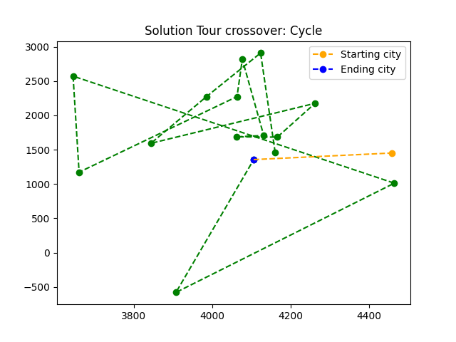

# Crossover for TSP-PROBLEM

 

The goal of the project is to implement several crossovers in the algorithm genetics that solves the traveling salesman problem (Travelling salesman problem). The traveling salesman problem is one of the typical case studies of theoretical computer science and computational complexity theory.

 

[GA-TSP](#crossover-for-tsp-problem)

- [Istances](#istances)

- [Istances-Converter](#istances-converter)

- [Log](#log)

- [Report](#report)

- [Result](#result)

- [TSP](#tsp)

[Run](#run)

- [Result](#example-of-result)

 

The name comes from its most typical representation:

 

Given a set of cities, and known distances between each pair of them, find the route of minimum travel distance that a traveling salesman must follow to visit all the cities once and only once and return to the starting city.

 

The project is divided into several folders, I am going to briefly explain the lor.

 

## Istances

Contains the main instances ( unconverted of tsp lib). For the creation of the algorithm first I had to choose the instances where to go to work. Of course, the testing of the algorithm was done on the above instances in the folder.

 

The instances were taken from the library:

 

http://comopt.ifi.uni-heidelberg.de/software/TSPLIB95/

 

In the library there are several instances, each instance is associated with a best solution which can be found in:

 

http://comopt.ifi.uni-heidelberg.de/software/TSPLIB95/STSP.html

 

Depending on the file selected, the coordinates of the instances had a different shape. I report in the example below only those used for the development of the project, in case you want to learn more about this topic you can find the documentation at the following link:

 

http://comopt.ifi.uni-heidelberg.de/software/TSPLIB95/DOC.PS

 

Examples of nomenclature:

 

- **EUC_2D:** weights are given in 2D Euclidean distance (x,y)
- **GEO:** weights are represented as geographic coordinates (lat,lng)

## Istances-Converter

Within this folder we then have the instances converted from lat,lng coordinates to x,y coordinates. I needed to go and do the conversion because in the I'm going to calculate the Euclidean distance between 2 points and obviously the coordinates have to be x,y coordinates and not lat,lng coordinates.

 

To perform the conversion, I used a script that applies the following forumula:

 

- $x = r \lambda \cos(\phi 0)$

- $y=r \phi$

 

where r = 6373 km and $\phi$, $\lambda$ are 2 constants. The results obtained, will then be approximated during the execution of the algorithm.

## Log

 

Within the log folder, we are going to save:

 

- Date and time of execution
- The file that contains the input instance
- The type of Crossover
- The length of the instance
- The number of iterations/generations
- Indices of the best path found
- The best-fitness relative to the path

## Report

The report folder contains specific documentation referring to the project

## Result

In the Result folder we would have as the name of the folder itself says, the results generated by the algorithm. The results are visible within the file **analisys.csv**.

## TSP

In the TSP folder is the source code of the project, there are 5 files:

 

- `config.yaml` ---> where we configure the main features of the algorithm
- `configuration.py` ---> where we are going to import the various configurations to the algorithm
- `GA_algo.py` ---> is the file containing the genetic algorithm
- `main.py` ---> main of program

# Run

To run the program **without** plotting the graphs:

 

- `python3 main.py -i 3 -o ../Result/`

 

To run the program **with** the graphs:

 

- `python3 main.py -i 3 -p -o ../Result/`

 

Where:

 

- **i** is a number of iteractions
- **o** is the folder of output

 

## Example of result

 

Example of fitness function:

 

 

Example of path:

 

_Enjoy 2F_
